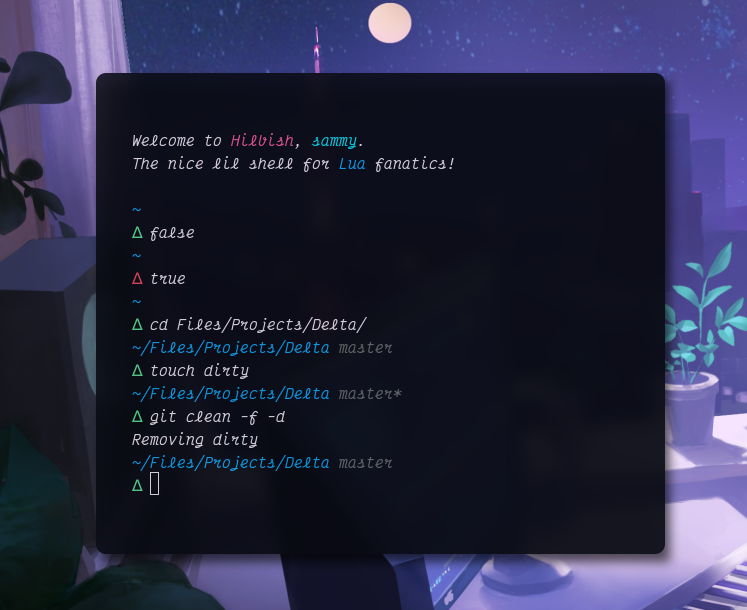

<div align="center">
	<h1>Delta</h1>
	<blockquote>🧪 A simple, minimal prompt for Hilbish.</blockquote>
	<br>
	
</div>

Delta is pretty, minimalist prompt for [Hilbish](https://github.com/Mewyuna/Hilbish),
inspired by [Pure](https://github.com/sindresorhus/pure).

Delta shows all that you'll really need:
current working directory, git branch and if its dirty, and of course the delta
prompt character.

# Installation
### Manually
Clone this directory to one of the paths Hilbish looks for libraries at.
```
git clone https://github.com/TorchedSammy/Delta ~/.local/share/hilbish/libs/delta
```

# Getting Started
Require Delta (`local delta = require 'delta'`) then initalize:
```lua
delta.init()
```  
It will handle the prompt on its own.

But if you want to manage your hooks/how it works more, you can go with the more
manual approach. Assuming you have the default config, replace the `doPrompt`
function with:  
```lua
function doPrompt(exitcode)
	prompt(delta.prompt(exitcode))
end
```  
Add `0` as an arg to the first call, then just pass `code` in the command.exit hook:
```lua
doPrompt(0)

bait.catch('command.exit', function(code)
	doPrompt(code)
end)
```  
To which you can now `dofile(os.getenv 'HOME' .. '/.hilbishrc.lua')` or restart
the shell.

# License
Delta is licensed under the BSD 3-Clause license.  
[Read here](LICENSE) for more info.
